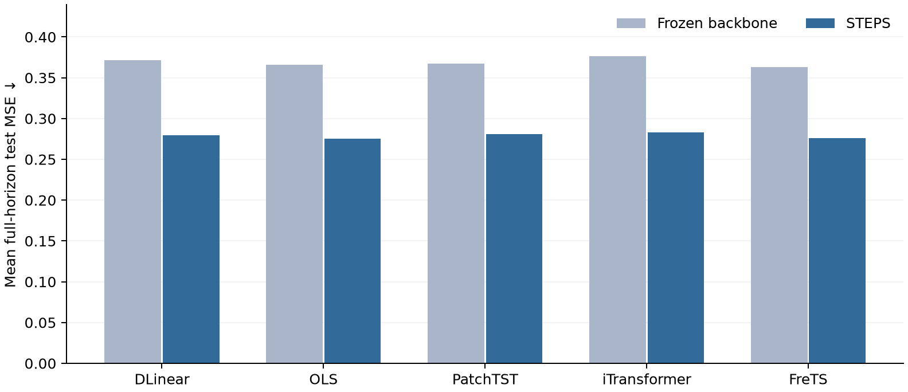

# STEPS

**Test-time adaptation for multivariate time-series forecasting**

Research implementation accompanying *STEPS: A Temporal Smooth Error Propagation Solver on the Manifolds for Test-Time Adaptation in Time Series Forecasting*. This is a prepublication code release; no conference acceptance is claimed.


STEPS revises a frozen backbone forecast after the first half of its horizon is observed. A local branch extends the observed prefix residual using a training-derived spectral prior. A global branch predicts smooth bias from mature historical residuals. The final suffix correction anchors to the local branch and adds the component of the global correction orthogonal to it.

## Results at a glance

The table below summarizes the manuscript's full-horizon test MSE over six datasets and four horizons per backbone. Lower is better. Values are means of the **rounded manuscript table entries**, not new measurements.

| Backbone | Frozen backbone | STEPS | Relative change |
|:--|--:|--:|--:|
| DLinear | 0.3716 | 0.2794 | −24.8% |
| OLS | 0.3661 | 0.2753 | −24.8% |
| PatchTST | 0.3677 | 0.2809 | −23.6% |
| iTransformer | 0.3762 | 0.2833 | −24.7% |
| FreTS | 0.3634 | 0.2758 | −24.1% |
| TimeMixer | — | 0.2831 | — |

The manuscript does not provide comparable frozen-backbone MSE entries for TimeMixer, so its baseline and relative change are omitted. The [complete 144-cell paper table](docs/RESULTS.md) and [machine-readable transcription](docs/paper_results.csv) are included. The comparison tables in the manuscript also report TAFAS, PETSA, and COSA variants; those external numbers are not redistributed here.




## Reproduce the adapter evaluation

This repository contains the **STEPS adapter, its fixed parameter search, the cache reader, and the evaluation protocol**. It contains no backbone weights, pretrained checkpoints, forecast caches, or raw datasets. You must supply frozen backbone predictions and the corresponding split series in the format below. This separation lets the adapter be evaluated without shipping model weights.

```bash
python -m venv .venv
source .venv/bin/activate
pip install -r requirements.txt
python -m steps.runner --cache-dir /path/to/frozen_cache \
  --backbones DLinear --datasets ETTh1 --horizons 96
```

Omit the backbone, dataset, and horizon filters to run all 144 cells. Per-cell JSON and `summary.json` are written to `results/final_method_grid/` unless `--output-dir` is given. The runner reuses existing results by default; pass `--overwrite` to rerun them.

For each cell, provide `train`, `val`, and `test` folders:

```text
frozen_cache/
  DLinear_ETTh1_H96_seed0_ep30_b256/
    train/{metadata.json,prediction.npy,series.npy}
    val/{metadata.json,prediction.npy,series.npy}
    test/{metadata.json,prediction.npy,series.npy}
```

`prediction.npy` has shape `(N, H, C)`. `series.npy` has shape `(N + lookback + H - 1 or longer, C)` and starts at the first input time point for that split. `metadata.json` must contain `{"lookback": <integer>}`. For origin `i`, the history is `series[i:i+lookback]` and the target is `series[i+lookback:i+lookback+H]`. Origins must be in chronological order, one time step apart. See [the full protocol](docs/PROTOCOL.md) and [fixed configuration](configs/final_grid.json).

## Repository layout

```text
steps/method.py       Final local and global correction operators
steps/cache.py        Frozen forecast cache reader
steps/runner.py       Validation selection and 144-cell evaluation
configs/              Fixed experiment parameters
docs/                 Protocol and manuscript result tables
assets/               Figures used in the manuscript
tests/                Synthetic protocol checks
```

## Citation

The accompanying manuscript is in preparation for conference submission. A bibliographic entry and preprint link will be added when public metadata is available; please cite the manuscript title above in the meantime.

## License

See [LICENSE](LICENSE).
